# 视觉质检 MobileInspectionApp —— 项目总结报告（面向甲方）

> **文档性质**：面向甲方的项目阶段总结与讲解材料。
> **更新日期**：2026-09-04
> **应用包名**：`com.wearable.inspection.mobile`
> **说明**：本文内容均来自工程源码、阶段报告和离线评估产物，未虚构准确率、召回率、工时、人天或现场验收结果。

---

## 一、项目概览

### 1.1 这个项目解决什么问题

在穿戴式工业视觉终端上，质检人员需要对流水线零件按**固定视角**拍照留证，并针对零件上的**关键部位（ROI，即"感兴趣区域"，指零件照片中需要重点检查的局部区域，如螺纹、螺母）**逐一进行合格/不合格的人工判定，最终生成可追溯、可导出的检测报告，用于质量管理和责任追溯。

本项目把"模板配置 → 现场采集 → 人工确认 → 结果导出 → 追溯管理"整条链路做成了一个可离线使用的 Android 应用，不依赖后台网络，数据全部保存在设备本地。

### 1.2 项目目标与使用对象

| 项目 | 说明 |
|---|---|
| 项目名称 | 视觉质检 MobileInspectionApp |
| 项目目标 | 实现按模板视角的现场拍照采集、ROI 人工确认、检测报告生成与 ZIP/CSV 导出、采集批次追溯管理；离线完成，数据本机保存 |
| 主要使用对象 | 产线质检人员（现场采集与确认）、质量管理人员（追溯与报告导出）、工艺/模板配置人员（模板与 ROI 配置） |
| 当前版本状态 | B1 相机基础已完成并通过真机验收；B2 主要软件链路完成，部分真机验收待执行；B3 OCR 软件完成；B3 ROI 检测器为离线原型，尚未接入 Android |
| 应用包名 | `com.wearable.inspection.mobile` |

### 1.3 项目当前结论（一页速览）

- **已完成的核心能力**：相机基础（画幅、坐标、真实拍照与存储）、模板配置、DPM（Data Matrix 二维码）扫码绑定、模板包导入导出、逐视角 ROI 配置与属性标注、现场多视角拍照、ROI 人工 OK/NG 确认、检测报告生成、ZIP + Excel 兼容 CSV 导出、采集批次筛选/删除/追溯、钢印 OCR 页面。
- **当前可以演示的流程**：创建模板与零件 → 绑定 DPM → 配置各视角 ROI → 现场按视角顺序拍照 → 人工逐 ROI 判定 OK/NG → 生成报告 → 导出 ZIP → 追溯记录管理。**整套流程可以在当前 APK 上演示。**
- **仍在验证或延期的能力**：B2 部分真机验收项待执行（人工确认、多 View 批次复用、ZIP 导出等）；ROI 离线检测算法（Thread 螺纹 / Nut 螺母 / Feature 部件）已完成离线原型回归，**尚未接入 Android 现场检测**；现场级准确率因缺少人工标注数据，**当前无法计算**。
- **当前最大的技术风险**：Thread 螺纹检测器在"移除螺纹纹理"的原图派生负样本上仍有 14/16 被判为 `PASS`，暴露出**全图搜索会把邻近圆形结构误判为螺纹**的风险。该问题需要在接入 Android 时用模板 ROI / 空间约束解决，并补充真实负样本。
- **术语约定**：`PASS`（检测通过）/ `FAIL`（检测不通过）/ `REVIEW`（证据不足，需人工复核）是离线算法结果；人工 OK/NG 是人工确认结果；两者不是同一件事，本文始终分开表述。

### 1.4 已完成 / 进行中 / 延期 / 待验收事项

| 事项 | 状态（统一状态词） |
|---|---|
| A/B0：工程边界、旧工程迁移审计、源码结构整理 | 已完成 |
| B1：相机基础、CameraX、画幅、contentRect、真实拍照与存储、完整回归 | 已完成（通过真机验收） |
| B2：DPM 扫码、模板包、透明叠加、ROI 属性、模板拍摄、人工确认、ZIP 导出 | 软件完成（主要链路），部分真机验收待执行 |
| B3 OCR：钢印 OCR 算法与界面集成 | 软件完成 |
| B3 ROI 算法：Thread / Nut / Feature 离线检测器 | 离线原型完成；Android 集成延期 |
| 文档、APK 与 Git 交付 | 已完成 |
| 模板 ROI 属性选择 | 已完成（真机验收通过） |
| 采集批次多选删除、时间筛选 | 软件完成（待用户验收） |
| 采集过渡与模板包闭环优化 | 软件完成（自动化与真机验收待执行） |
| 现场级准确率评估 | 数据不足（DCIM 无人工标注） |

---

## 二、工程工作量总览

本项目**未提供按人天统计的工时记录**，为避免编造，以下采用可复现的实际交付量（源码、测试、报告、图片证据）统计，不虚构人天。

| 交付维度 | 当前规模或结果 | 说明 |
|---|---:|---|
| Android 主源码 | 106 个 Kotlin 文件 | 相机、数据、模板、采集、追溯、导出、DPM、OCR、页面导航等 |
| JVM 测试 | 56 个 Kotlin 测试文件 | 覆盖数据持久化、坐标映射、导出、导航、相机状态和 UI 状态契约 |
| Instrumented 测试 | 7 个 Kotlin 测试文件 | 覆盖相机生命周期、DPM 设置、外键、数据库等设备侧契约 |
| 离线算法代码 | 4 个 Python 文件 | 数据准备、Thread/Nut/Feature 检测、评估与测试 |
| 项目报告 | 34 个 Markdown 报告 | B1/B2/B3 阶段报告、算法报告、验收记录和迁移审计 |
| 项目流程图片 | 20 张 | 已复制到本仓库 `docs/online/client-report-assets/` 并按业务顺序引用 |
| Debug APK 构建 | 构建成功 | 构建记录见第九章，本工程 APK 未做真机安装验收 |

### 2.1 按阶段说明

| 阶段 | 主要工作 | 当前状态 |
|---|---|---|
| A / B0 | 新工程边界、旧工程迁移审计、源码结构整理 | 已完成 |
| B1 | 相机基础：唯一 CameraX 控制器、状态与生命周期、画幅与 contentRect、真实拍照与存储、完整回归 | 已完成并通过真机验收 |
| B2 | DPM 迁移、模板包导入导出、模板透明叠加、ROI 属性、模板拍摄/排序、人工确认、ZIP 导出、批次管理 | 软件完成；部分真机验收待执行 |
| B3 OCR | 钢印 OCR 核心算法与 CameraX/UI 集成 | 软件完成；JVM 308 项中 303 通过、0 失败、5 跳过 |
| B3 ROI 算法 | Thread、Nut、Feature 三个轻量离线检测器与评估数据链路 | 离线原型完成；Android 集成延期 |
| 文档与交付 | 使用说明、工程总结、APK 构建、分批 Git 提交 | 已完成 |

**当前限制**：ROI 检测器是离线 Python 原型，当前 APK 的"软件检测结果"字段保持空值（未执行），不伪造 PASS/FAIL；现场检测结果只能来自人工 OK/NG 确认。

---

## 三、系统功能和业务流程（按实际使用顺序）

> 以下按现场实际使用顺序介绍 20 个关键步骤。每个步骤说明其作用、操作方式、系统保存的数据、当前版本注意事项和对应截图。

### 步骤 1：进入现场采集（模板配置入口）

- **作用**：进入现场采集主界面；如果当前零件还没有配置模板，会先引导进入模板配置。
- **操作**：打开 App，进入"现场采集"页，选择零件。
- **系统保存/处理**：加载当前零件的模板状态；未配置模板时提示先配置。
- **当前版本注意事项**：首次使用前需先完成模板和零件配置。
- **对应截图**：

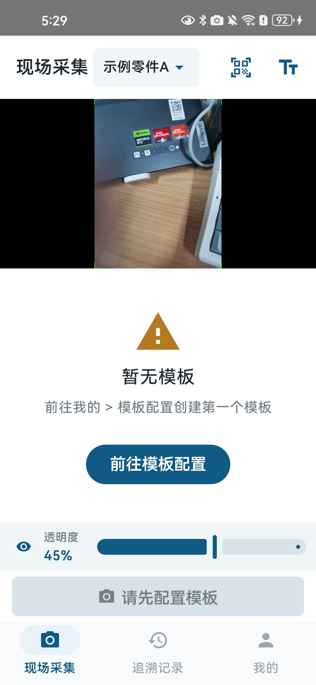

*图 1：现场采集入口，提示当前零件尚未完成模板配置。*

### 步骤 2：创建模板

- **作用**：为零件建立模板容器，后续的视角、图片和 ROI 都归属于该模板。
- **操作**：在模板配置页点击"新建模板"。
- **系统保存/处理**：创建一条模板记录，保存模板 ID 与名称。
- **当前版本注意事项**：一个零件通常对应一个模板；模板可包含多个采集视角（View）。
- **对应截图**：

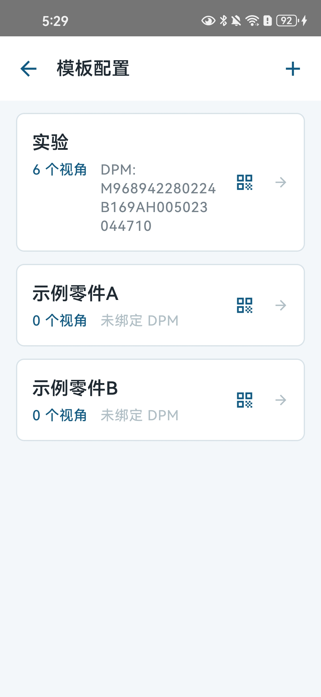

*图 2：新建模板，后续模板视角、图片和 ROI 都归属于该模板。*

### 步骤 3：创建零件并填写 ID 和名称

- **作用**：登记待质检的零件身份，便于追溯和导出区分。
- **操作**：在模板配置中创建零件，填写零件 ID 和名称。
- **系统保存/处理**：保存零件 ID、名称和关联模板。
- **当前版本注意事项**：建议使用稳定的零件 ID（不频繁变更），以保证追溯记录可对应。
- **对应截图**：

*图 3：创建模板所属零件，建议使用稳定的零件 ID，便于追溯和导出。*

### 步骤 4：绑定 DPM 码，拍摄或导入模板视角图片

- **作用**：为零件关联 DPM 码（Data Matrix 二维码，工业零件常用的一种二维码），并准备模板视角图片（拍摄或从相册导入）。
- **操作**：零件创建完成后，可绑定 DPM 码；进入模板视角后拍摄或导入参考图片。
- **系统保存/处理**：保存 DPM 码与零件的绑定关系；保存模板视角图片。
- **当前版本注意事项**：DPM 入口只支持手机相机实时扫码，不提供相册码图导入；绑定冲突会被拒绝。
- **对应截图**：

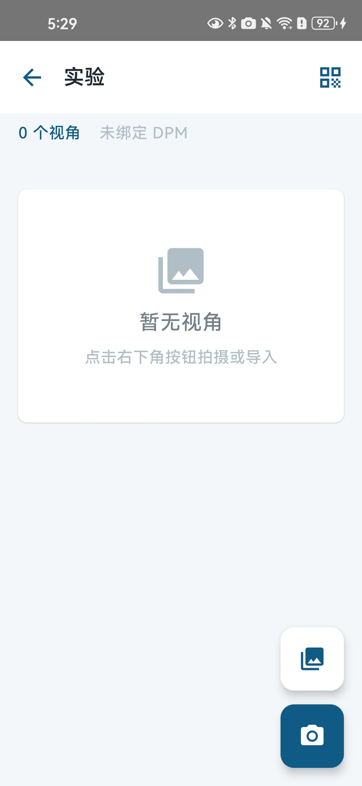

*图 4：零件创建完成后，可以绑定 DPM 码，并进入模板视角拍摄或导入图片。*

### 步骤 5：模板配置完成，开始采集

- **作用**：模板配置就绪后，返回现场采集流程。
- **操作**：确认模板和零件已就绪，进入现场采集。
- **系统保存/处理**：以当前模板为基准，准备按视角顺序采集。
- **当前版本注意事项**：模板配置完成前，现场采集无法正常进行。
- **对应截图**：

*图 5：模板配置完成后进入现场采集。*

### 步骤 6：配对 DPM 码（现场扫码）

- **作用**：现场通过扫码快速定位零件并加载对应模板。
- **操作**：在现场采集页点击"扫一扫"，对准零件上的 DPM 码。
- **系统保存/处理**：按 `dpmCode` 查找零件并切换当前零件与模板；未知码只提示先完成模板绑定。
- **当前版本注意事项**：只支持实时扫码；绑定过的 DPM 码命中后自动切换零件。
- **对应截图**：

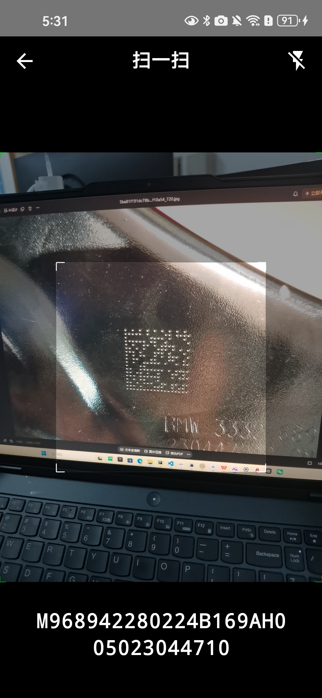

*图 6：为零件绑定 DPM 码；冲突绑定应被拒绝，未知码只提示先完成模板绑定。*

### 步骤 7：在单个视角设置 ROI

- **作用**：在某个模板视角上框选需要重点检查的关键部位（ROI）。
- **操作**：在模板视角图片上新增、选中、移动、缩放、删除 ROI 框。
- **系统保存/处理**：ROI 使用归一化坐标 `normalizedRect`（0~1 相对坐标）保存，按模板、View 和图片独立保存。
- **当前版本注意事项**：ROI 框的位置要覆盖真实关键部位，后续人工确认将按该区域裁剪展示。
- **对应截图**：

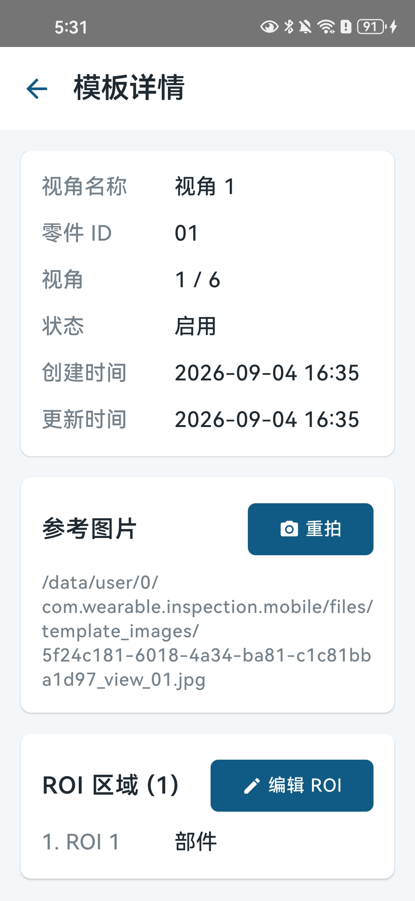

*图 7：在单个模板视角中绘制和调整 ROI。*

### 步骤 8：选择 ROI 属性

- **作用**：为每个 ROI 标注目标类型，为后续选择一致的检测算法做数据准备。
- **操作**：编辑 ROI 时选择属性：`螺纹（THREAD）` / `螺母（NUT）` / `部件（FEATURE）`。
- **系统保存/处理**：保存 ROI 的 `targetType` 字段；同一 View 中不同 ROI 可以设置不同属性。
- **当前版本注意事项**：新增 ROI 必须选择属性；历史 ROI 没有属性时显示"未选择"，**系统不会自动猜测**。
- **对应截图**：

*图 8：编辑 ROI 时选择"螺纹 / 螺母 / 部件"目标属性。*

### 步骤 9：保存模板配置

- **作用**：确认 ROI 位置和属性后保存模板。
- **操作**：点击保存；属性未选择时保存按钮不可用。
- **系统保存/处理**：保存模板、View 顺序、图片和全部 ROI 配置（含属性）。
- **当前版本注意事项**：未选择属性的 ROI 不能被保存为"配置完成"。
- **对应截图**：

*图 9：确认 ROI 位置和属性后保存模板配置。*

### 步骤 10：按模板 View 顺序进行现场拍照

- **作用**：按模板定义的视角顺序逐 View 采集现场照片。
- **操作**：在现场采集页对准当前视角拍照；照片真实落库并关联当前采集批次。
- **系统保存/处理**：保存原始照片，写入采集批次 `batchId`，并记录 View 索引、模板 ID、拍摄时间。
- **当前版本注意事项**：有 ROI 的 View 拍照后进入人工确认；无 ROI 的 View 只保存照片并自动进入下一视角，不生成虚假的 ROI 检测记录。
- **对应截图**：

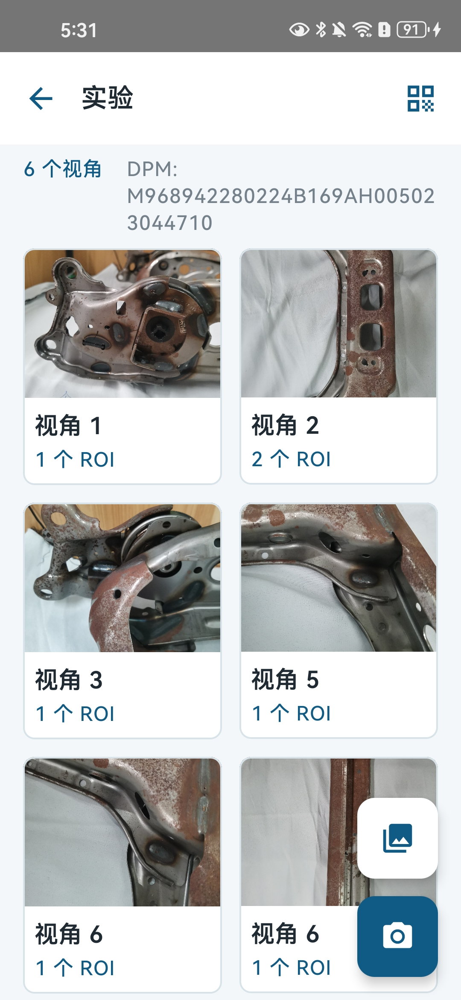

*图 10：当前视角完成拍照并保存现场照片。*

### 步骤 11：切换采集视角

- **作用**：按模板顺序切换到下一个采集视角。
- **操作**：确认完成后由系统自动推进，或在顶部切换器选择视角。
- **系统保存/处理**：切换视角后加载该视角对应的模板和 ROI。
- **当前版本注意事项**：切换零件时已修复模板图片与 ROI 偶发缺失问题。
- **对应截图**：

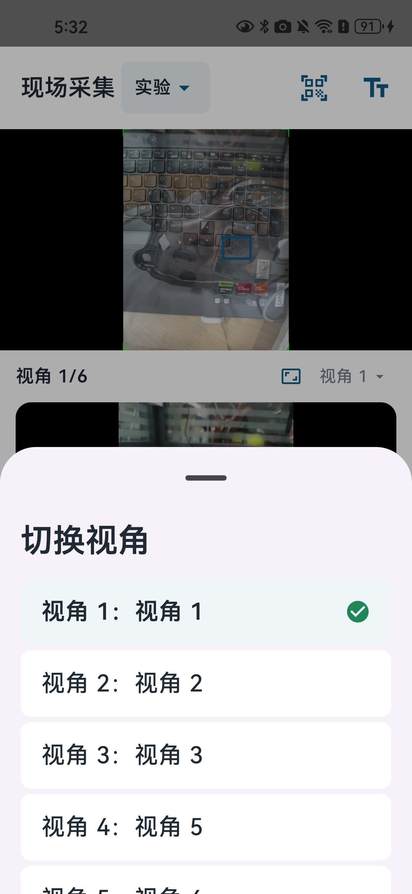

*图 11：按模板顺序切换到下一个采集视角。*

### 步骤 12：有 ROI 的 View 进入人工确认

- **作用**：拍照后对关键部位逐个人工判定。
- **操作**：对每个 ROI 选择 OK/NG，并单独选择整张照片的总体 OK/NG；未选择时系统不默认结果。
- **系统保存/处理**：保存逐 ROI 人工确认记录（含照片、ROI、像素坐标、人工结果、时间）和总体判定；**软件检测结果保持空值（未执行）**。
- **当前版本注意事项**：人工 OK/NG 是人工确认结果，不等于算法 PASS/FAIL；ROI 或总体为 NG 时仍必须保存。
- **对应截图**：

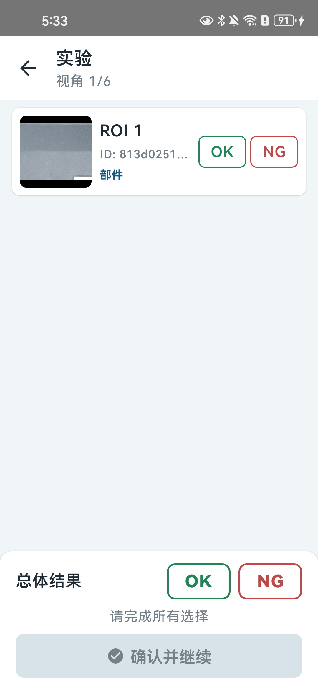

*图 12：拍照后对每个 ROI 选择 OK/NG，同时选择整张照片总体 OK/NG；未选择时不默认结果。*

### 步骤 13：所有 View 完成后生成检测报告（下载/分享）

- **作用**：全部视角采集并确认完成后，生成检测报告并可下载或分享结果包。
- **操作**：最后一 View 完成后自动进入检测报告页，点击下载或分享。
- **系统保存/处理**：以稳定 `batchId` 关联本次采集，生成 ZIP 结果包。
- **当前版本注意事项**：只有所有 View 完成且照片索引完整后才允许导出；采集中批次不能导出 ZIP。
- **对应截图**：

*图 13：全部视角完成后进入检测报告页，可下载或分享结果包。*

### 步骤 14：查看 ZIP 包

- **作用**：查看导出结果包的总体结构。
- **操作**：用解压工具打开导出的 ZIP 包。
- **系统保存/处理**：ZIP 按 View 分目录保存原始照片，并包含一个综合结果 CSV。
- **当前版本注意事项**：ZIP 只包含真实照片和真实人工确认结果，不伪造检测数据。
- **对应截图**：

*图 14：ZIP 包整体结构示意。*

### 步骤 15：查看 ZIP 中的照片

- **作用**：核对 ZIP 包内按视角组织的原始现场照片。
- **操作**：打开 ZIP 中 `views/view_XX/` 目录。
- **系统保存/处理**：每个 View 的原始照片按视角分目录保存，同一 View 重拍照片全部保留。
- **当前版本注意事项**：照片为现场原始图片，不做算法修改。
- **对应截图**：

*图 15：ZIP 包按采集视角组织原始现场照片。*

### 步骤 16：查看 Excel 兼容 CSV

- **作用**：用 Excel 打开结果数据文件，查看照片索引和逐 ROI 人工确认记录。
- **操作**：将 CSV 用 Excel 直接打开（UTF-8 BOM 编码，不乱码）。
- **系统保存/处理**：综合 CSV 包含照片行与 ROI 确认行，共 15 列，覆盖图片名、视角、模板、ROI、目标类型、像素坐标、软件结果（空）、人工结果、时间、总体判定、零件与批次。
- **当前版本注意事项**：结果是 Excel 兼容 CSV，不是原生 XLSX；无 ROI 的 View 只写照片索引行，不伪造确认行。
- **对应截图**：

*图 16：结果文件为 UTF-8 BOM 的 Excel 兼容 CSV，不伪造为独立 XLSX。*

### 步骤 17：查看追溯记录（删除/下载）

- **作用**：按零件、批次查看历史采集记录，支持时间筛选、批量删除和下载导出。
- **操作**：进入"追溯记录"，选择时间范围（今日/近 3 天/近 7 天/所有），选中批次后可删除或导出。
- **系统保存/处理**：基于数据库 `startTime` 字段筛选；按稳定 `batchId` 精确删除批次及其照片与确认记录；导出只对已完成批次开放。
- **当前版本注意事项**：删除操作不可恢复；正在导出的批次禁止删除。
- **对应截图**：

*图 17：追溯记录列表中的批次筛选、下载和清理入口。*

### 步骤 18：模板包导入导出

- **作用**：将模板（含图片、View 顺序、ROI 配置和属性）整体打包迁移到另一台设备。
- **操作**：在模板包页面选择导出 ZIP，或导入本应用导出的 ZIP。
- **系统保存/处理**：导出包包含零件、DPM、全部 View/图片、顺序和全部 ROI 配置（含 `targetType`）；导入可恢复 View 图片、顺序和 ROI 配置，并兼容旧包格式。
- **当前版本注意事项**：导入前会拒绝没有有效视角图片的包；导入失败时旧模板保持不变。
- **对应截图**：

*图 18：模板包导入/导出，保留模板图片、View 顺序和 ROI 配置。*

### 步骤 19：零件管理（左滑删除）

- **作用**：管理已配置的零件，可删除不需要的零件。
- **操作**：在零件管理列表左滑零件，出现删除入口。
- **系统保存/处理**：删除前需二次确认；删除后清理关联模板、ROI 和受管理模板图片，历史采集批次保留可追溯。
- **当前版本注意事项**：删除操作有二次确认，避免误删。
- **对应截图**：

*图 19：零件管理中的删除操作入口。*

### 步骤 20：零件删除二次确认

- **作用**：删除零件前再次确认，防止误删。
- **操作**：点击确认后执行删除。
- **系统保存/处理**：确认后删除该零件对应模板、ROI 及受管理图片；历史采集批次通过外键保留。
- **当前版本注意事项**：确认框会显示零件名称等信息。
- **对应截图**：

*图 20：删除零件前显示零件名称等信息并二次确认，避免误删。*

---

## 四、ROI 配置说明

**结论**：ROI（感兴趣区域）是模板视角中用于定位关键部位的可编辑矩形区域，当前已完整支持新增、选中、移动、缩放、删除和属性标注，坐标为归一化坐标并独立持久化；属性用于后续算法路由，但当前**不把离线算法写成已接入 APK**。

| 配置项 | 说明 |
|---|---|
| 坐标保存方式 | ROI 使用 `normalizedRect`（0~1 归一化坐标）保存，不依赖具体图片像素，模板迁移后仍有效 |
| 编辑能力 | 支持新增、选中、移动、缩放、删除，并有边界约束 |
| 数据隔离 | ROI 坐标按模板、View 和图片独立保存；切换 View、重进页面、删除重建后不串用、不丢失 |
| 属性差异 | 同一 View 中不同 ROI 可以设置不同属性 |
| 属性类型 | `THREAD`（螺纹）、`NUT`（螺母）、`FEATURE`（部件） |
| 未选择状态 | 历史 ROI 没有属性时显示"未选择"；未选择属性时**不自动猜测**检测算法，也不显示"配置完成" |
| 属性用途 | 当前 ROI 属性用于后续检测算法路由（`THREAD`→螺纹检测、`NUT`→螺母检测、`FEATURE`→部件检测） |
| 当前任务边界 | 本阶段只实现属性保存和离线算法验证；**不把离线算法写成已经接入 APK 的现场实时检测** |

---

## 五、Thread 螺纹 ROI 算法

**结论**：螺纹检测器（`ThreadPresenceDetector`）在 Key 正样本上全部通过（16/16 PASS），通用合成负样本全部被拦截（12/12 未 PASS）；但原图派生"无螺纹孔"负样本仍有 14/16 被判 PASS，暴露全图搜索误检邻近圆形结构的风险。**当前是离线原型，未接入 Android 现场检测。**

### 5.1 检测原理（面向甲方的说明）

螺纹检测器通过以下步骤判断一个区域是否为螺纹孔：

| 检测环节 | 说明 |
|---|---|
| Hough 圆候选生成 | 先用霍夫圆检测（Hough 圆检测，一种在图像中寻找圆形结构的方法）生成候选圆孔 |
| 局部圆心和半径精修 | 对每个候选圆做局部搜索，修正圆心位置和半径，不直接使用粗检结果 |
| 几何证据 | 检查圆周边缘覆盖率、角度分布、径向一致性等圆形几何证据 |
| 中心暗孔证据 | 检查中心是否有暗孔、暗孔是否与圆心共心 |
| 周期纹理证据 | 检查径向方向是否存在周期性纹理（螺纹的特征） |
| 清晰度和背景惩罚 | 图像模糊或候选圆穿过背景结构会被惩罚或拦截 |

**结果状态含义**：
- `PASS`：证据充分，判定为螺纹；
- `FAIL`：无候选或证据不成立；
- `REVIEW`：证据不足或图像质量低，需要人工复核，**不等于检测通过**。

**当前是否已接入 Android**：否。检测器位于离线 Python 工程 `tools/feature_presence/`，未接入 APK 现场流程。

### 5.2 真实评估结果

| 数据集 | 数量 | 结果 | 说明 |
|---|---:|---|---|
| Thread Key 正样本 | 16 | **16/16 `PASS`** | 未发现状态级漏检；`thread_13` 缺失（编号不连续），不补造样本 |
| 通用合成负样本 | 12 | **12/12 未 `PASS`** | 普通圆孔、亮圆、断裂环、线性纹理、随机噪声等均被拦截 |
| 原图派生"无螺纹孔"负样本 | 16 | **14 `PASS`、2 `REVIEW`** | 暴露全图搜索可能误选邻近圆形结构的问题 |

> **重要**：以上结果是小规模离线回归，**不代表正式现场准确率**。Key 没有像素级圆心/半径标注，因此不能把结果写成准确率或真实定位误差。

*图 21：Thread Key 批量结果；橙色为 raw Hough 候选，绿色为 refined 精修圆。*

### 5.3 通用合成负样本说明

这组 12 张负样本用于验证"有圆形边缘但没有可靠螺纹纹理"时，检测器是否会误判为 Thread：

- 普通圆孔、亮圆、非同心环、单段圆弧、径向边缘、背景圆环、模糊纹理、普通垫圈、线性纹理、断裂圆环、随机噪声、径向辐条。

**结论**：12/12 未 `PASS`，说明当前门禁可以拦截这组负样本（它们主要因缺少重复纹理证据进入 `REVIEW`，线性纹理被背景穿越门禁拦截，随机噪声因中心暗孔/纹理振幅证据不足被拦截）。

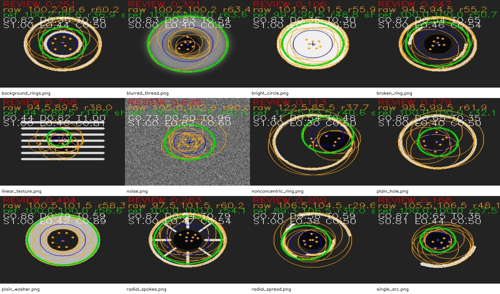

*图 22：Thread 通用合成负样本，覆盖普通圆孔、亮圆、非同心环、单段圆弧、径向边缘、背景圆环、模糊纹理、普通垫圈、线性纹理、断裂圆环、随机噪声和径向辐条。*

### 5.4 原图派生负样本说明

从 16 张 Thread 正样本逐张生成"无螺纹孔"版本（只移除目标圆内的螺纹纹理，圆外像素保持不变），更接近真实误检风险。结果 14/16 `PASS`、2/16 `REVIEW`：许多精修圆跳到了原图中仍存在的**邻近圆形结构**上。

> **必须明确**：**不能把 14/16 PASS 写成算法通过**。该结果不是生成失败，而是当前全图搜索仍存在误检风险的明确证据；应作为后续 **ROI 空间约束和真实负样本扩充**的依据。

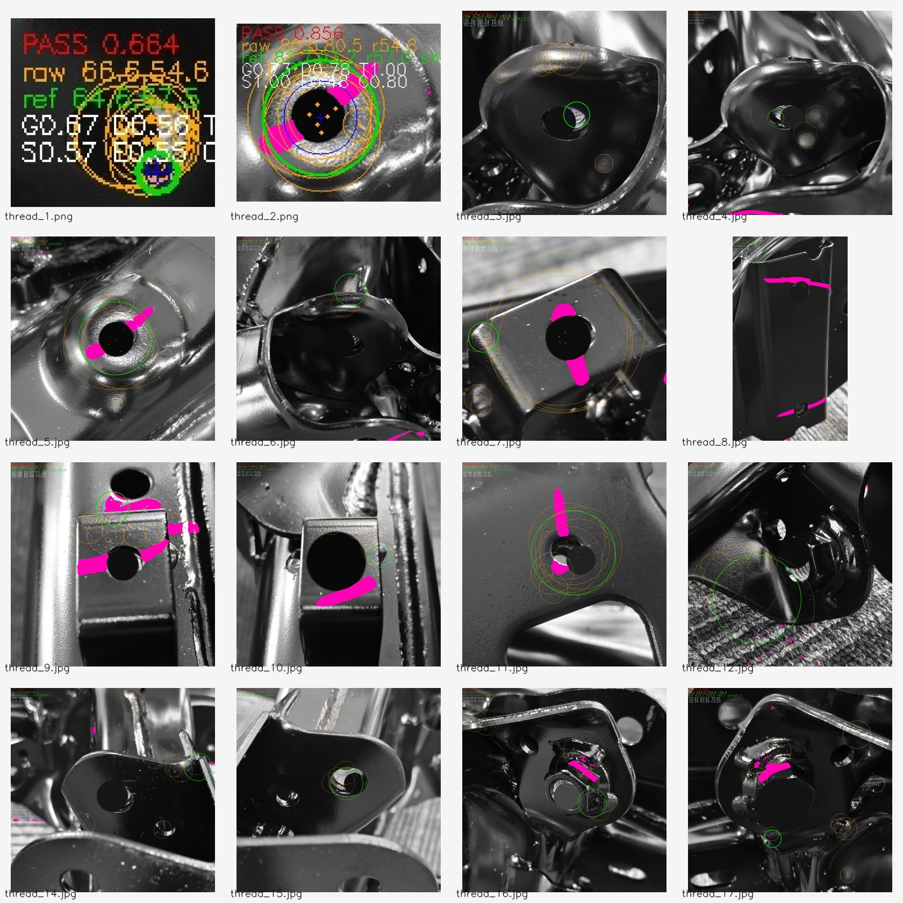

*图 23：Thread 原图派生"无螺纹孔"负样本。目标区域的内侧螺纹纹理被移除，其他区域尽量保持原图不变；绿色圆跳到邻近圆形结构说明存在误检风险。*

---

## 六、Nut 螺母 ROI 算法

**结论**：螺母检测器（`NutPresenceDetector`）在 5 张 Key 样本上均检出 2 个螺母主体框，其中 3 张 `PASS`、2 张 `REVIEW`；两类负样本（通用 8 张、原图派生 5 张）均无候选、无最终框。**当前是离线原型，未接入 Android 现场检测。**

### 6.1 检测原理（面向甲方的说明）

| 检测环节 | 说明 |
|---|---|
| CLAHE | 自适应直方图均衡化，增强图像局部对比度 |
| Canny | 边缘检测，提取轮廓线 |
| Otsu 和多亮度阈值 | 用多种亮度阈值分离螺母主体与背景 |
| 嵌套轮廓 | 用 `RETR_TREE` 层级轮廓寻找内部近六边形/侧面证据 |
| 近六边形几何 | 判断主体是否为 5~7 边的近六边形（螺母外形的特征） |
| 中心孔证据 | 检查是否有真实中心孔及环边缘证据 |
| IoU 和 containment NMS | 用重叠度/包含关系去重，避免同一螺母被重复框选 |
| 主体 box 恢复 | 用凸包和稳定顶点数恢复螺母主体框，避免只框住垫圈或亮斑 |
| expectedCount | 期望螺母数量由运行时配置提供（`expectedCount`），不写死在检测器中 |

**结果状态含义**：
- `PASS`：证据充分；
- `FAIL`：数量不符；
- `REVIEW`：数量正确但几何/中心孔质量低于门槛，需人工复核，**不表示误检 PASS，也不通过抬高 score 强制改为 PASS**。

**当前是否已接入 Android**：否。

### 6.2 真实评估结果

5 张 Nut Key 图片均由项目方确认包含 **2 个螺母**，回归时使用运行时 `expectedCount=2`；5 张图片最终都检出 **2 个主体框**。

| 文件 | 状态 | score | 最终数量 | 说明 |
|---|---|---:|---:|---|
| `nut_1.png` | `PASS` | `0.6945` | 2 | 左右两个完整螺母主体 |
| `nut_3.jpg` | `PASS` | `0.5929` | 2 | 2 个主体框 |
| `nut_4.jpg` | `PASS` | `0.5876` | 2 | 2 个主体框 |
| `nut_5.jpg` | `REVIEW` | `0.4785` | 2 | 数量正确但质量证据不足 |
| `nut_6.jpg` | `REVIEW` | `0.4598` | 2 | 数量正确但质量证据不足 |

> **必须明确**：`nut_5`、`nut_6` 数量正确但质量证据不足，因此保留 `REVIEW`；**不得通过抬高 score 强制改成 PASS**。本轮优化通过增加多亮度分支、嵌套轮廓、中心孔证据和 NMS 来提升质量，而不是无条件放宽门槛。

*图 24：Nut Key 批量结果；绿色框为 NMS 后的主体框，六边形默认几何角度为 0°。*

### 6.3 通用合成负样本说明

8 张通用负样本覆盖：普通圆形、单纯亮斑、金属高光、嵌套高光、非六边形背景、偏心孔、仅垫圈、无孔六边形。

**结果**：**8/8 无候选、无最终框**。检测器要求近六边形主体、中心孔和几何证据同时成立，因此圆形、亮斑、垫圈或无中心孔的图像不会生成螺母框。本组回归使用 `expectedCount=0`，空结果保持系统既有 `REVIEW` 语义——**`REVIEW` 不表示误检 PASS**，应理解为"没有检测到目标，等待人工复核"。

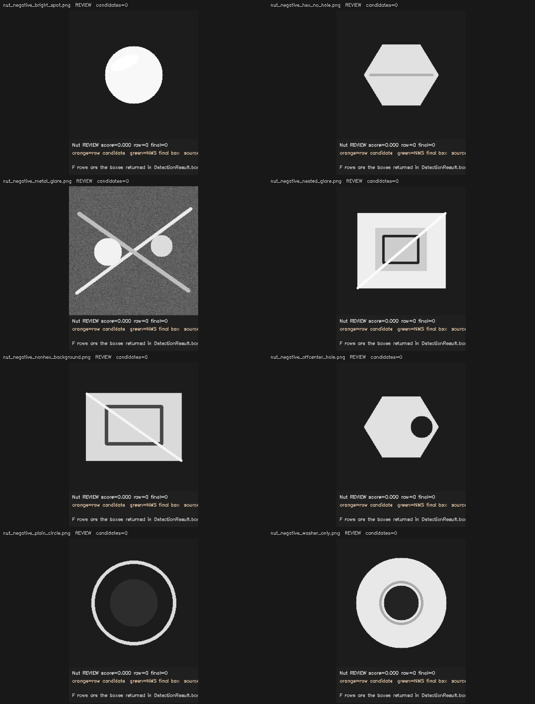

*图 25：Nut 通用合成负样本，覆盖普通圆形、单纯亮斑、金属高光、嵌套高光、非六边形背景、偏心孔、仅垫圈和无孔六边形。*

### 6.4 原图派生负样本说明

从 5 张 Nut Key 原图派生 5 张"无螺母零件"图（按正样本主体框推导移除完整螺母/垫圈组件，移除区域外像素保持不变）。

**结果**：**5/5 无候选、无最终框**。说明当前 Nut 规则对"没有螺母但保留零件背景"的样本具有较好保守性；但这仍然只是小规模离线回归，不能替代真实现场负样本评估。

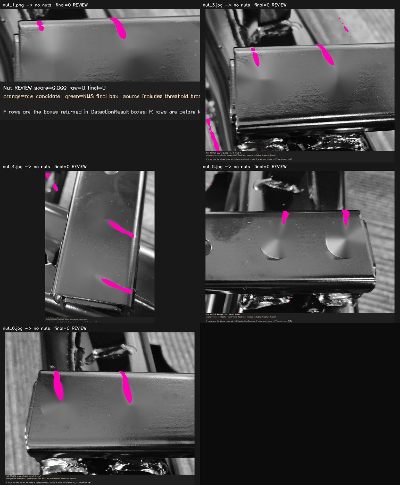

*图 26：Nut 原图派生"无螺母零件"负样本，每张按正样本主体框动态推导移除区域并用原图邻域修复。*

---

## 七、Feature 部件算法

**结论**：部件检测器（`FeaturePresenceDetector`）的 Key 自检通过（`feature_1.png`、`feature_2.png` 均为 `PASS`），但**当前没有实现 Homography（单应性变换）、SIFT（尺度不变特征变换）、自动姿态对齐和自动 ROI**，**尚未接入 Android 现场检测**。

### 7.1 检测原理

| 检测环节 | 说明 |
|---|---|
| DCT pHash 粗筛 | 用离散余弦变换感知哈希做快速粗筛，判断部件与模板整体是否相似 |
| 多尺度模板匹配 | 在多个尺度上做模板匹配，输出最佳匹配分数、尺度和匹配框 |
| AKAZE 特征点 | 提取尺度不变的特征点（AKAZE 是一种局部特征提取算法） |
| BFMatcher 和 Lowe ratio | 用暴力匹配器匹配特征点，并用 Lowe ratio 过滤误匹配 |
| affine RANSAC 一致性 | 用仿射变换估计（affine RANSAC）计算内点比例和覆盖范围，验证几何一致性 |

- `feature_1.png`、`feature_2.png` 的 Key 自检结果均为 `PASS`（pHash、模板匹配、AKAZE/RANSAC 均有证据）。
- 未实现：Homography、SIFT、自动姿态对齐、自动 ROI。
- 当前尚未接入 Android 现场检测（与 Thread、Nut 相同，为离线原型）。

---

## 八、数据集和评估边界

**结论**：当前只有两类数据——**Key 样本回归**（验证离线检测器能运行）和 **DCIM 现场大图**（无人工标注，无法计算现场准确率）。**Key 的 PASS 不是现场准确率；离线算法 PASS 不是 APK 已接入现场实时检测。**

### 8.1 一、Key 样本回归

- 用途：验证离线检测器是否能够运行。
- 内容：Thread 16 张、Nut 5 张、Feature 2 张，共 23 张可读图片。
- 性质：Key 图片本身是**已经裁剪好的 ROI 小图**，回归时使用 `[0,0,1,1]` 作为模板 ROI 约定（整图即 ROI）。
- 限制：Key 回归只证明离线链路可运行，**不能代表现场准确率**。

### 8.2 二、DCIM 现场数据

| 项目 | 当前事实 |
|---|---|
| 图片数量 | 30 张 JPG |
| 可读性 | 图片全部可读 |
| 目标记录 | 120 个 |
| 标签 | 全部为 `unknown` |
| ROI | 全部为 `null` |
| 标注状态 | `annotationStatus` 为 `UNANNOTATED`（未标注） |
| 人工确认的目标位置 | 无 |
| present/absent 标签 | 无 |

**因 DCIM 没有人工确认的目标 ROI 和 present/absent 标签，当前不能计算 accuracy（准确率）、recall（召回率）或 confusion matrix（混淆矩阵），评估状态为 `INSUFFICIENT_DATA`（数据不足）。**

### 8.3 三条必须明确的边界

1. **Key 的 PASS 不是现场准确率**：Key 是裁剪好的正样本小图，不包含真实现场中的邻近结构、遮挡和反光。
2. **离线算法 PASS 不是 APK 已经接入现场实时检测**：当前 Thread/Nut/Feature 均为离线原型，Android 集成属于后续工作。
3. **人工 OK/NG 不等于算法 PASS/FAIL**：当前 APK 的软件检测结果保持空值（未执行），现场判定来自人工确认。

---

## 九、测试和交付记录

**结论**：离线算法测试全部通过，数据准备 self-test 通过，Android Debug APK 构建成功；本文不修改 APK 或源码。

### 9.1 自动化验证记录

| 验证项 | 结果 |
|---|---|
| Thread 专项回归 | 16 tests，`OK`（16 张 Thread Key 全部 `PASS`） |
| Nut/Feature/Thread 综合离线验收 | 17 tests，`OK` |
| Nut 原图派生负样本专项回归 | 4/4 `PASS` |
| 数据准备 self-test | `SELF_TEST_PASS` |
| Key/DCIM 图片解码检查 | Key 5/5、DCIM 30/30 可读 |
| DCIM 检测评估 | 120/120 `SKIPPED`，未伪造准确率 |
| Android Debug APK | `assembleDebug` 构建成功 |

### 9.2 Android Debug APK 构建记录

以下为工程报告中记录的构建结果（APK 已构建成功，未执行真机安装验收）：

| 项目 | 值 |
|---|---|
| APK 路径 | `app/build/outputs/apk/debug/app-debug.apk` |
| 构建时间 | `2026-09-04 18:17:46` |
| 大小 | `221,529,142` 字节 |
| SHA-256 | `6BFEF6CC61D826439C3F9A7B25041E14C554FC5C750813810B6B13F56D7F9179` |
| 启动组件 | `com.wearable.inspection.mobile/com.wearable.inspection.mobile.MainActivity` |

> 说明：构建命令为 `.\gradlew.bat :app:assembleDebug --no-daemon`。本次仅构建 APK，未执行安装、启动或真机验收。

### 9.3 Git 交付记录

- 当前分支：`main`（已与远程 `origin/main` 同步）。
- 主要交付提交：

| 提交 | 内容 |
|---|---|
| `57740875` | 在线报告补充负样本结果 |
| `efc8ecb0` | 带图片的项目总结报告 PDF |
| `b5c68d78` | 在线项目工作量与算法报告 |
| `c986ed58` | 带图片的使用说明文档 |
| `3a38ae4b` | B2 验证报告与任务清单 |
| `1a5aaea9` | 模板导入、视图顺序、采集流程及测试 |

- 本文档及 `docs/online/client-report-assets/` 图片为本轮新增内容，**不修改任何 APK 或源码**。

---

## 十、当前风险和下一步

**结论**：当前项目软件主链路可用，但 ROI 检测器仍为离线原型，现场级准确率数据不足，需要补充标注数据并完成 Android 集成与真机/物理验收后才能进入正式现场应用阶段。

### 10.1 当前风险（面向甲方的说明）

| 风险 | 说明 |
|---|---|
| Thread 全图搜索存在邻近结构误检风险 | 原图派生负样本 14/16 被判 PASS，说明全图搜索会把邻近圆形结构当成螺纹；必须依靠模板 ROI / 空间约束限制搜索范围 |
| Nut 的 `nut_5`、`nut_6` 需要进一步现场复核 | 这两张图数量正确但质量证据不足，保留 REVIEW；不应通过抬高阈值或强制 PASS 隐藏质量问题 |
| 当前 DCIM 数据没有人工 ROI，不能评估现场准确率 | 30 张现场大图无目标位置和 present/absent 标签，不能计算准确率、召回率或误检率 |
| 需要补充真实正样本和负样本 | 现有样本规模小，且负样本多为合成/派生，需补充真实现场样本 |
| 需要补充目标位置和 present/absent 标注 | 完成标注后才能做 holdout 评估 |
| 需要完成 Android 算法集成 | Thread/Nut/Feature 均为离线原型，需接入 APK 现场流程并验证性能 |
| 需要完成真机和物理验收 | B2 部分验收项、真机实时检测和物理 DPM 样本验收待执行 |

### 10.2 结果语义保持分离（重要约定）

- 软件检测结果仍可以是 `null`/未执行：当前 APK 不伪造检测结果。
- 人工 OK/NG 是人工确认结果：不等于算法 `PASS`/`FAIL`。
- `REVIEW` 是"证据不足需人工复核"，不等于误检 PASS。
- 离线回归结果不等于现场准确率。

### 10.3 下一步建议

1. 优先为 DCIM 现场大图补充人工 ROI 和 present/absent 标签，形成可评估数据集。
2. 使用模板 ROI / 空间约束限制 Thread 搜索范围，并补充真实负样本，解决邻近结构误检风险。
3. 将 Thread/Nut/Feature 离线检测器接入 Android，做真机性能与现场流程验证。
4. 完成 B2 剩余真机验收项和物理 DPM 样本验收。

---

## 附录：数据来源与证据入口

本文所有数据均来自以下可追溯来源（不另行编造）：

- 工程源码：`app/src/main/java/com/wearable/inspection/mobile/`
- 自动化测试：`app/src/test/`、`app/src/androidTest/`
- 离线算法：`tools/feature_presence/`
- 阶段报告：`docs/reports/b1/`、`docs/reports/b2/`、`docs/reports/b3/feature_presence/`
- 原始在线总结：`docs/online/PROJECT_WORKLOAD_AND_ALGORITHM_REPORT_20260904.md`
- 任务清单：`tasks/todo.md`

文档状态：**面向甲方的在线总结版已生成**。本文只引用仓库内可访问的图片和报告；涉及准确率、现场检测或物理验收的内容，均按当前真实证据保留边界。
