# 视觉质检 MobileInspectionApp

## 工程工作量、功能交付与 ROI 算法结果

更新时间：2026-09-04
仓库：[WangShu-0819/MobileInspectionApp](https://github.com/WangShu-0819/MobileInspectionApp)
应用包名：`com.wearable.inspection.mobile`
文档定位：项目阶段总结、现场使用说明、算法结果与验收边界

> 本文按“项目成果 → 业务流程 → ROI 算法 → 验证结论”的顺序整理。图片来自项目方提供的 `9.4 v1/图片` 目录；算法图来自仓库中的 B3 离线评估产物。

## 一页结论

- Android 工程已经完成相机基础、模板配置、DPM 扫码、模板包、现场多视角采集、人工确认、批次照片导出、追溯记录和 OCR 页面等主要链路。
- 最新 Debug APK 已由当前代码构建成功，输出文件为 `app/build/outputs/apk/debug/app-debug.apk`。
- Thread 和 Nut ROI 检测器目前是离线 Python 原型，已经完成 Key 样本和负样本回归；尚未接入 Android 现场检测流程。
- Nut Key 5 张图片都检测出 2 个主体框，其中 3 张为 `PASS`、2 张为 `REVIEW`；Thread Key 16 张全部为 `PASS`。
- 当前 DCIM 30 张现场大图没有人工 ROI 和 `present/absent` 标签，因此不能诚实地报告现场准确率、召回率或混淆矩阵。
- 当前仍需关注：Thread 全图搜索在“移除螺纹纹理”的原图派生负样本上出现 14/16 `PASS`；这说明现场必须使用可靠 ROI/模板范围，并继续补充真实负样本。

## 1. 工程工作量总览

本项目没有提供按人天统计的工时记录，下面采用“源码、测试、报告、图片证据和可复现命令”的实际交付量统计，不虚构人天。

| 交付维度 | 当前规模或结果 | 说明 |
|---|---:|---|
| Android 主源码 | 106 个 Kotlin 文件 | 相机、数据、模板、采集、追溯、导出、DPM、OCR、页面导航等 |
| JVM 测试 | 56 个 Kotlin 测试文件 | 覆盖数据持久化、坐标映射、导出、导航、相机状态和 UI 状态契约 |
| Instrumented 测试 | 7 个 Kotlin 测试文件 | 覆盖相机生命周期、DPM 设置等设备侧契约 |
| 离线算法 | 4 个 Python 文件 | 数据准备、Thread/Nut/Feature 检测、评估与测试 |
| 项目报告 | 34 个 Markdown 报告 | B1/B2/B3 阶段报告、算法报告、验收记录和迁移审计 |
| 项目方流程图片 | 20 张 | 已复制到本仓库 `docs/online/assets/` 并按业务顺序引用 |
| 最新 Debug APK | 221,529,142 字节 | 构建成功，未执行真机安装 |

### 阶段成果

| 阶段 | 主要工作 | 当前状态 |
|---|---|---|
| A / B0 | 新工程边界、旧工程迁移审计、源码结构整理 | 已完成 |
| B1 | CameraX 唯一控制器、状态/生命周期、画幅/contentRect、真实拍照与存储、完整回归 | 已完成并通过真机验收 |
| B2 | DPM 迁移、模板包导入、模板透明叠加、ROI 属性、模板拍摄/排序、人工确认和 ZIP 导出 | 主要软件链路已完成；部分真机验收待执行 |
| B3 OCR | 钢印 OCR 核心算法和 CameraX/UI 集成 | 软件完成；JVM 308 项中 303 通过、0 失败、5 跳过 |
| B3 ROI 算法 | Thread、Nut、Feature 三个轻量离线检测器和评估数据链路 | 离线原型完成；Android 集成延期 |
| 文档与交付 | 使用说明、工程总结、APK 构建和分批 Git 提交 | 已完成 |

## 2. 当前版本交付物

### APK

构建命令：

```powershell
.\gradlew.bat :app:assembleDebug --no-daemon
```

结果：`BUILD SUCCESSFUL`，38 个 actionable tasks，7 个执行、4 个来自缓存、27 个最新。

| 项目 | 值 |
|---|---|
| APK 路径 | `D:\study\Textile_defects\Wearable Inspection\MobileInspectionApp\app\build\outputs\apk\debug\app-debug.apk` |
| 构建时间 | `2026-09-04 18:17:46` |
| 大小 | `221,529,142` 字节 |
| SHA-256 | `6BFEF6CC61D826439C3F9A7B25041E14C554FC5C750813810B6B13F56D7F9179` |
| 启动组件 | `com.wearable.inspection.mobile/com.wearable.inspection.mobile.MainActivity` |

本次仅构建 APK，没有执行安装、启动或真机验收。

### Git 交付

当前 `main` 分支已推送到远程仓库，最近三批提交如下：

| 提交 | 内容 |
|---|---|
| `1a5aaea9` | 模板导入、视图顺序、采集流程及测试 |
| `3a38ae4b` | B2 验证报告与任务清单 |
| `c986ed58` | 带图片的使用说明文档及生成脚本 |

## 3. 现场使用流程（按业务顺序）

### 3.1 进入现场采集并配置模板

首次进入现场采集时，如果当前零件没有可用模板，应先进入模板配置。模板配置的基本顺序是：创建模板 → 创建零件 → 录入零件 ID/名称 → 配置 DPM → 添加或导入模板视角。


*图 1：现场采集入口发现当前零件尚未完成模板配置。*


*图 2：新建模板，后续模板视角、图片和 ROI 都归属于该模板。*

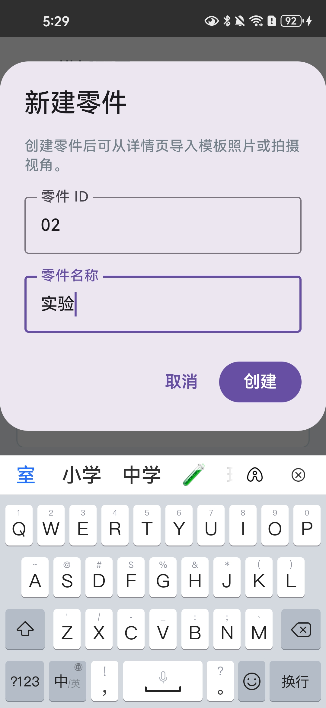

*图 3：创建模板所属零件，建议使用稳定的零件 ID，便于追溯和导出。*


*图 4：零件创建完成后，可以绑定 DPM 码，并进入模板视角拍摄或导入图片。*

### 3.2 绑定 DPM 并准备模板视角

DPM 入口只支持手机相机实时扫码，不提供相册码图导入。绑定成功后，现场扫码可以按 `dpmCode` 查找零件并加载对应模板。

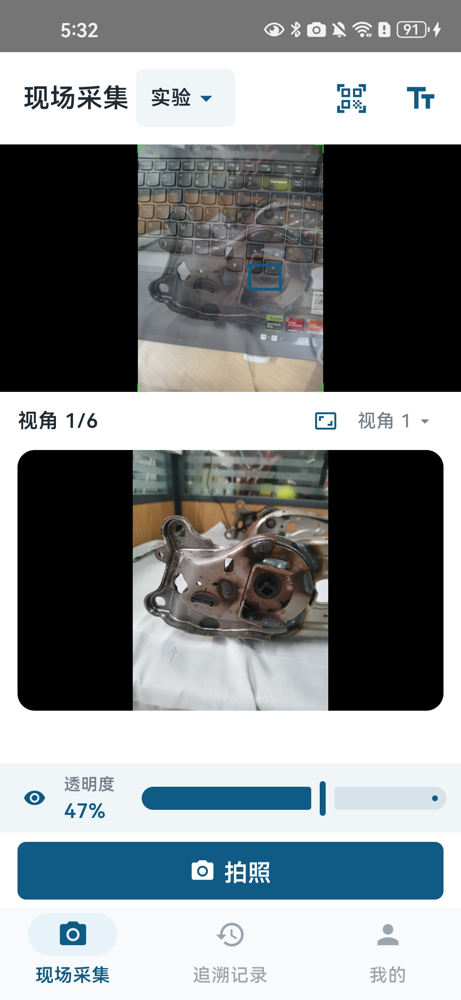

*图 5：模板配置完成后进入现场采集。*


*图 6：为零件绑定 DPM 码；冲突绑定应被拒绝，未知码只提示先完成模板绑定。*

### 3.3 设置每个视角的 ROI 和目标属性

模板视角中可以新增、选中、移动、缩放、删除 ROI，并保存 `normalizedRect`。每个 ROI 还要选择目标属性：

- `THREAD`：螺纹
- `NUT`：螺母
- `FEATURE`：部件

历史 ROI 没有属性时显示“未选择”，不会自动猜测。属性按模板、View 和图片独立持久化，同一 View 中不同 ROI 可以选择不同属性。


*图 7：在单个模板视角中绘制和调整 ROI。*

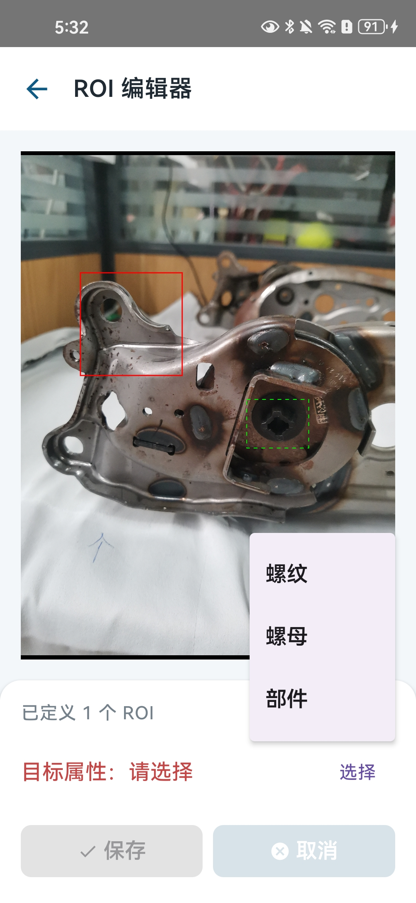

*图 8：编辑 ROI 时选择“螺纹 / 螺母 / 部件”目标属性。*

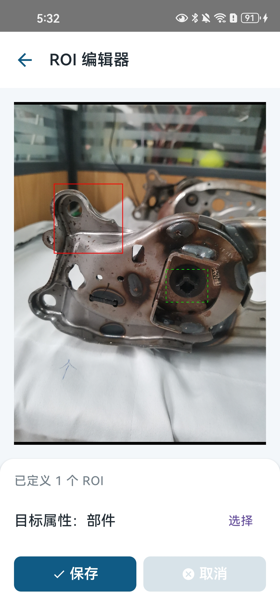

*图 9：确认 ROI 位置和属性后保存模板配置。*

### 3.4 多视角现场拍照与人工确认

现场采集按模板中的 View 顺序进行。每个 View 拍照后，照片先真实写入当前采集批次；有 ROI 的 View 进入确认页，逐个选择 ROI 的 OK/NG，并单独选择整张照片总体 OK/NG；没有 ROI 的 View 只保存照片并继续推进，不生成虚假的 ROI 检测记录。


*图 10：当前视角完成拍照并保存现场照片。*


*图 11：按模板顺序切换到下一个采集视角。*


*图 12：拍照后对每个 ROI 选择 OK/NG，同时选择整张照片总体 OK/NG；未选择时不默认结果。*

### 3.5 生成报告和导出 ZIP

所有 View 都完成并且照片索引完整后，才允许生成检测报告。导出 ZIP 以稳定的 `batchId` 关联本次采集，按 View 分目录保存原始照片，并写入一个综合 `inspection_result.csv`。

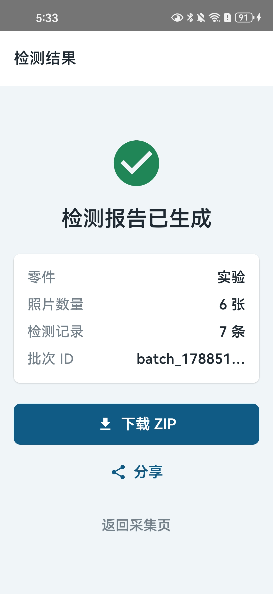

*图 13：全部视角完成后进入检测报告页，可下载或分享结果包。*

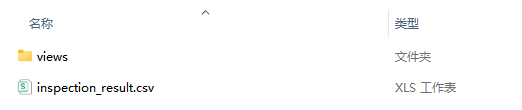

*图 14：ZIP 包整体结构示意。*

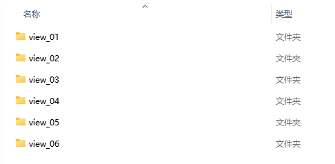

*图 15：ZIP 包按采集视角组织原始现场照片。*

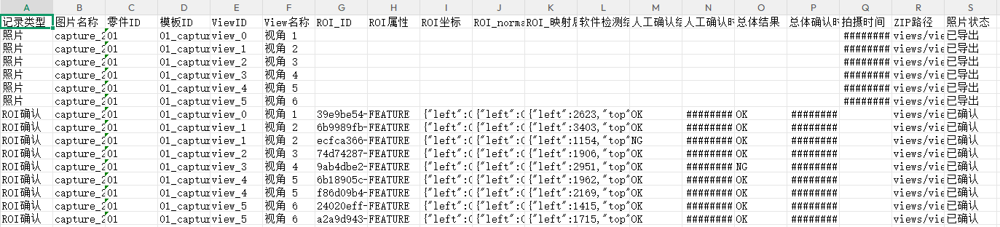

*图 16：结果文件为 UTF-8 BOM 的 Excel 兼容 CSV，不伪造为独立 XLSX。*

### 3.6 追溯记录、模板包和零件管理

追溯记录可以按零件、批次查看和导出；已完成批次才允许导出 ZIP。模板包用于迁移模板、视角、图片、顺序、DPM 和 ROI 属性；零件管理提供左滑删除和二次确认。

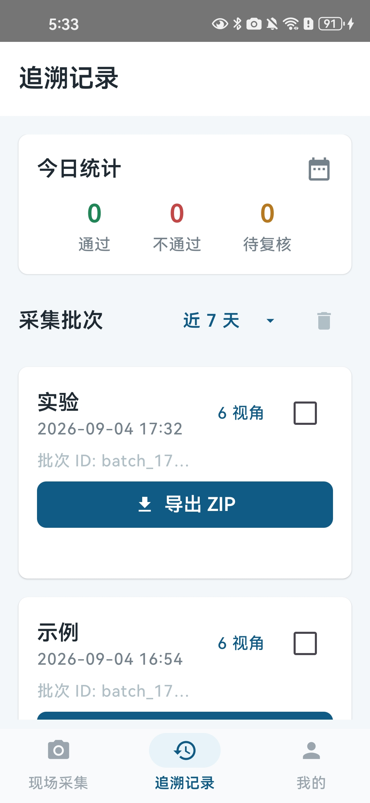

*图 17：追溯记录列表中的批次筛选、下载和清理入口。*

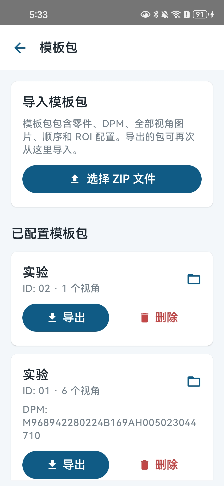

*图 18：模板包导入/导出，保留模板图片、View 顺序和 ROI 配置。*

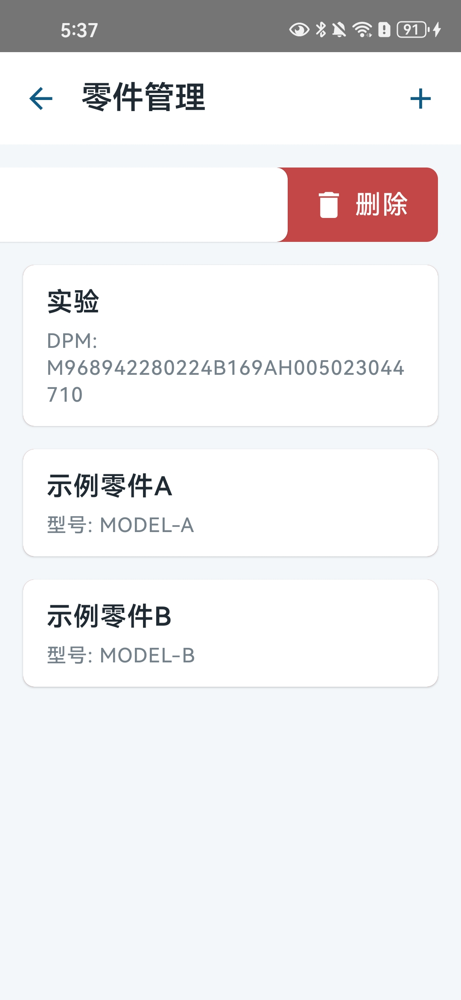

*图 19：零件管理中的删除操作入口。*

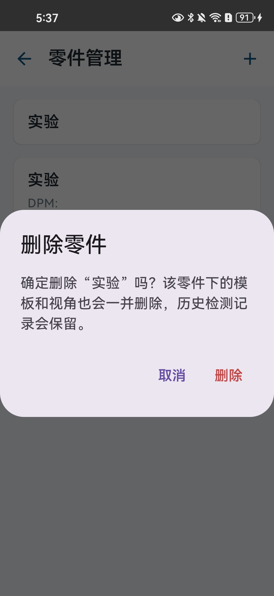

*图 20：删除零件前显示零件名称等信息并二次确认，避免误删。*

## 4. ROI 算法当前结果

### 4.1 算法定位

当前 B3 算法是 `presence-offline.3` 离线原型，源码位于 [`tools/feature_presence/presence_detectors.py`](../../tools/feature_presence/presence_detectors.py)。三个检测器共享统一的 `DetectionResult`、ROI 校验和 debug 输出接口，但尚未接入 Android App。

| 检测器 | 主要方法 | 输出 |
|---|---|---|
| ThreadPresenceDetector | Hough 圆候选 → 局部圆心/半径精修 → 圆几何、中心暗孔、周期纹理和清晰度评分 | 圆、box、score、metrics、PASS/FAIL/REVIEW |
| NutPresenceDetector | CLAHE/Canny/Otsu 多阈值 → 嵌套轮廓和近六边形主体 → 中心孔证据 → IoU/containment NMS | 多个主体 box、每框评分、数量和 PASS/REVIEW |
| FeaturePresenceDetector | DCT pHash 粗筛 → 多尺度模板匹配 → AKAZE/BFMatcher → affine RANSAC 一致性 | 匹配框、相似度、特征点和覆盖度证据 |

### 4.2 Thread（螺纹）结果

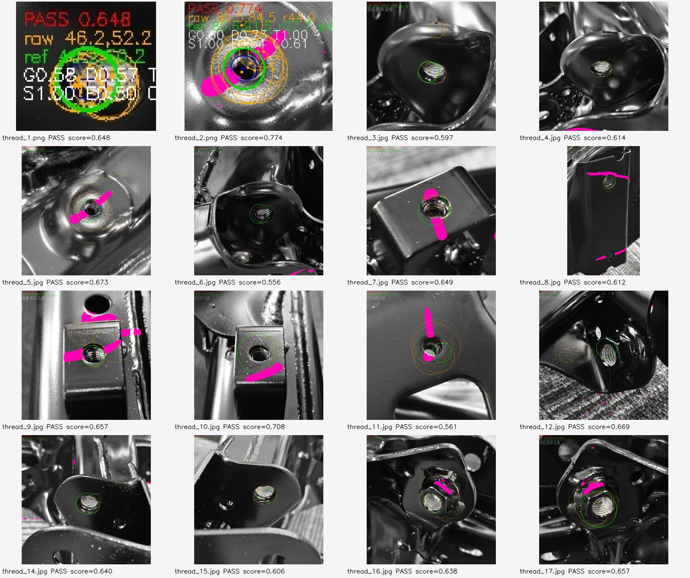

*图 21：Thread Key 批量结果；橙色为 raw Hough 候选，绿色为 refined 圆。*

| 数据集 | 数量 | 结果 | 结论 |
|---|---:|---|---|
| Thread Key 正样本 | 16 | 16/16 `PASS` | 未发现状态级漏检；`thread_13` 缺失，不补造样本 |
| 通用合成负样本 | 12 | 12/12 未 `PASS` | 普通圆孔、亮圆、断裂环、线性纹理、随机噪声等被拦截 |
| 原图派生“无螺纹孔”负样本 | 16 | 14 `PASS`、2 `REVIEW` | 未通过负样本鲁棒性；暴露全图搜索误选邻近圆形结构的风险 |

实现重点：保留多路 Hough 候选，但只把 Hough 作为 seed；随后执行局部圆心/半径搜索、暗孔中心 proposal、几何支持、圆周角度覆盖、周期纹理、共心度和背景惩罚。新增背景穿越和中心暗孔/纹理振幅门禁，用于拦截线性结构和随机噪声伪造的纹理证据。

Thread 的代表性精修结果：

| 样本 | raw Hough | refined 圆 | shift | score |
|---|---|---|---:|---:|
| `thread_1.png` | `(46.20,52.20,r19.72)` | `(46.20,50.20,r19.93)` | `2.00` | `0.648` |
| `thread_2.png` | `(89.50,84.50,r44.90)` | `(80.57,91.49,r27.72)` | `11.34` | `0.774` |
| `thread_5.jpg` | `(570.89,623.95,r261.80)` | `(608.73,594.02,r104.72)` | `48.24` | `0.673` |
| `thread_17.jpg` | `(486.86,513.85,r142.01)` | `(491.01,610.31,r147.13)` | `96.55` | `0.657` |

其中 `shift` 是 raw Hough 圆心到 refined 圆心的距离，不是相对人工真值的误差。Key 没有像素级圆心/半径标注，因此不能把它写成准确率或真实定位误差。

### 4.3 Nut（螺母）结果

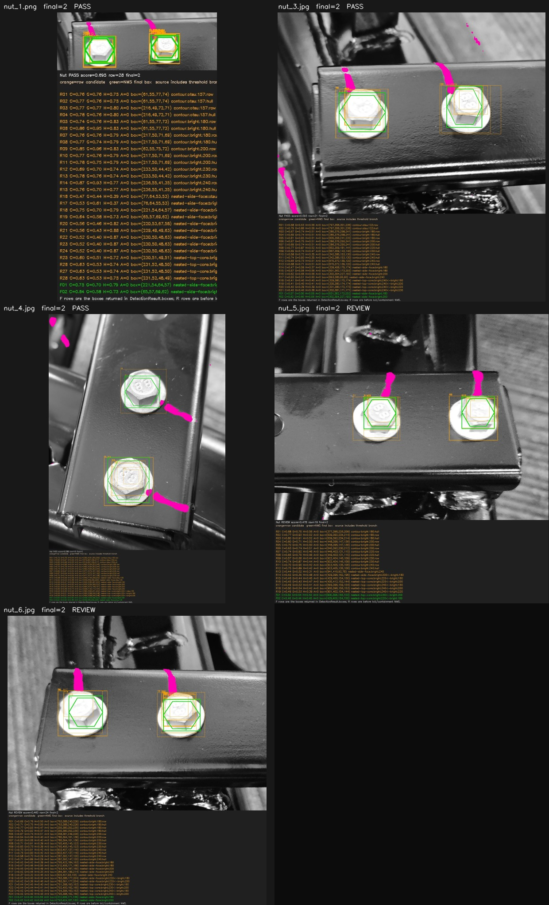

*图 22：Nut Key 批量结果；绿色框为 NMS 后的主体框，六边形默认几何角度为 0°。*

五张 Nut Key 图片均由项目方确认包含 2 个螺母，回归时通过运行时 `expectedCount=2` 验证；这个值没有写死到检测器中。

| 文件 | 状态 | score | 最终数量 | 最终框 |
|---|---|---:|---:|---|
| `nut_1.png` | `PASS` | `0.6945` | 2 | `[[221,54,64,57],[65,57,69,62]]` |
| `nut_3.jpg` | `PASS` | `0.5929` | 2 | `[[831,362,173,202],[302,394,227,192]]` |
| `nut_4.jpg` | `PASS` | `0.5876` | 2 | `[[426,1034,298,323],[549,446,250,228]]` |
| `nut_5.jpg` | `REVIEW` | `0.4785` | 2 | `[[900,396,156,153],[429,400,154,150]]` |
| `nut_6.jpg` | `REVIEW` | `0.4598` | 2 | `[[312,406,171,166],[793,424,187,160]]` |

本轮优化没有降低几何门槛或无条件抬高 score，而是增加多亮度分支、`RETR_TREE` 嵌套轮廓、凸包恢复、中心孔证据和 NMS。`nut_5`、`nut_6` 虽然数量正确，但图像质量/几何证据不足，所以保留 `REVIEW`。

Nut 负样本结果：

| 数据集 | 数量 | 结果 | 解释 |
|---|---:|---|---|
| 通用合成负样本 | 8 | 8/8 无候选、无最终框 | 当前 `expectedCount=0` 的空结果语义为 `REVIEW`，不是误检 PASS |
| 原图派生无螺母零件 | 5 | 5/5 无候选、无最终框 | 保持原图其他区域像素，移除完整螺母/垫圈组件 |

### 4.4 Feature（部件）结果

Feature 检测器使用 pHash、模板匹配和 AKAZE/affine RANSAC 的轻量证据链。Key 自检中的 `feature_1.png` 和 `feature_2.png` 均为 `PASS`，但它同样不等于现场准确率。当前不实现 Homography、SIFT、自动姿态对齐或自动 ROI。

## 5. 数据、测试与验收边界

### 数据集现状

- Key：当前目录包含 23 张可读图片：Thread 16 张、Nut 5 张、Feature 2 张；Key 图片本身是已裁剪 ROI 小图，使用 `[0,0,1,1]` 作为模板 ROI 约定。早期 Task 1 数据清点报告是在样本尚未扩充时生成的，记录的是当时的 5 张基准图，后续专项报告以自动发现的完整批次为准。
- DCIM：30 张 JPG，全部可读；其中 120 个目标记录的标签全部为 `unknown`，ROI 全部为 `null`，状态为 `UNANNOTATED`。
- 因 DCIM 没有人工确认的目标 ROI 和 `present/absent` 标签，评估结果为 `INSUFFICIENT_DATA`，不计算 accuracy、recall 或 confusion matrix。

### 已有自动化验证

| 验证项 | 结果 |
|---|---|
| Thread 专项回归 | 16 tests，`OK`，16 张 Thread Key 全部 `PASS` |
| Nut/Feature/Thread 综合离线验收 | 17 tests，`OK` |
| 数据准备 self-test | `SELF_TEST_PASS` |
| Key/DCIM 解码检查 | Key 5/5、DCIM 30/30 可读 |
| DCIM 检测评估 | 120/120 `SKIPPED`，未伪造准确率 |
| Android Debug APK | `assembleDebug` 成功 |

算法复现解释器：

```text
D:\ProgramData\anaconda3\envs\dinov2\python.exe
```

报告和完整机器可读结果：

- [离线原型总报告](../reports/b3/feature_presence/OFFLINE_PROTOTYPE_REPORT.md)
- [Thread 精修报告](../reports/b3/feature_presence/THREAD_REFINEMENT_REPORT.md)
- [Nut 精修报告](../reports/b3/feature_presence/NUT_REFINEMENT_REPORT.md)
- [数据集清点报告](../reports/b3/feature_presence/TASK1_DATASET_REPORT.md)

## 6. 当前未完成项与下一步

1. **ROI 算法尚未接入 Android**：当前结果只能证明离线算法链路和样本回归可运行，不能表示 APK 已经在现场实时检测。
2. **需要人工标注 DCIM**：补充真实 ROI、present/absent 标签和训练/验证划分后，才能计算现场准确率、召回率和误检率。
3. **Thread 需要限制搜索范围**：原图派生负样本中 14/16 仍 `PASS`，说明全图搜索可能把邻近圆形结构当成螺纹，应优先使用模板 ROI 或更严格的空间约束。
4. **Nut 的 REVIEW 需要现场复核**：`nut_5`、`nut_6` 数量正确但置信度较低，不应通过抬高阈值或强制 PASS 隐藏质量问题。
5. **B2 仍有验收项**：人工确认、多 View 批次复用、无 ROI View、ZIP 导出和 DPM 的部分真机/物理验收需要在指定设备上继续验证。
6. **结果语义保持分离**：软件检测结果仍可为 null/未执行；人工 OK/NG 是人工确认，不应伪装成算法 PASS/FAIL。

## 7. 主要代码和报告入口

### Android

- [`app/src/main/java/com/wearable/inspection/mobile/camera/`](../../app/src/main/java/com/wearable/inspection/mobile/camera/)：唯一 CameraX 控制器及分析模式
- [`app/src/main/java/com/wearable/inspection/mobile/template/`](../../app/src/main/java/com/wearable/inspection/mobile/template/)：模板包、模板图片和 View 顺序
- [`app/src/main/java/com/wearable/inspection/mobile/ui/screens/LiveInspectionScreen.kt`](../../app/src/main/java/com/wearable/inspection/mobile/ui/screens/LiveInspectionScreen.kt)：现场拍照、模板叠加和采集推进
- [`app/src/main/java/com/wearable/inspection/mobile/ui/screens/ViewConfirmationScreen.kt`](../../app/src/main/java/com/wearable/inspection/mobile/ui/screens/ViewConfirmationScreen.kt)：ROI/总体人工确认
- [`app/src/main/java/com/wearable/inspection/mobile/data/export/InspectionZipExportService.kt`](../../app/src/main/java/com/wearable/inspection/mobile/data/export/InspectionZipExportService.kt)：照片和综合 CSV 导出
- [`app/src/main/java/com/wearable/inspection/mobile/ui/screens/TraceRecordsScreen.kt`](../../app/src/main/java/com/wearable/inspection/mobile/ui/screens/TraceRecordsScreen.kt)：追溯记录和批次操作

### 离线算法

- [`tools/feature_presence/presence_detectors.py`](../../tools/feature_presence/presence_detectors.py)：Thread/Nut/Feature 检测器
- [`tools/feature_presence/evaluate_presence.py`](../../tools/feature_presence/evaluate_presence.py)：批量评估
- [`tools/feature_presence/prepare_dataset.py`](../../tools/feature_presence/prepare_dataset.py)：Key/DCIM 数据清点、方向处理和 ground truth 骨架
- [`tools/feature_presence/test_presence_detectors.py`](../../tools/feature_presence/test_presence_detectors.py)：离线检测器回归测试

---

文档状态：**在线总结版已生成**。本文只引用仓库内可访问的图片和报告；涉及准确率、现场检测或物理验收的内容，均按当前真实证据保留边界。
